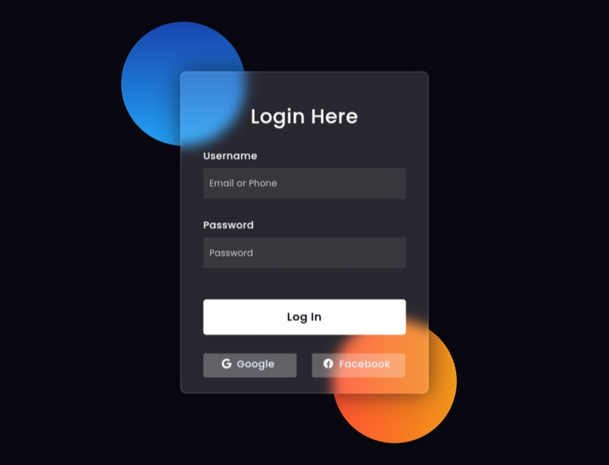

# Login Glassmorphism

A modern login page designed with HTML and CSS, implementing a glassmorphism effect for a sleek and minimalistic UI. This login page is perfect for web applications, providing a visually appealing interface for user authentication.

## Features
- Glassmorphism design for a modern look.
- Simple and clean HTML structure.
- Fully responsive CSS for different devices.
- Social login buttons for Google and Facebook.

## Screenshot

  

## Download

Click the button below to download the source code:

<a href="https://github.com/y-nabeelxd/Login-Glassmorphism/blob/main/index.html" download>
  <button style="padding: 10px 20px; background-color: #4CAF50; color: white; border: none; border-radius: 5px; cursor: pointer;">
    Download Here
  </button>
</a>
